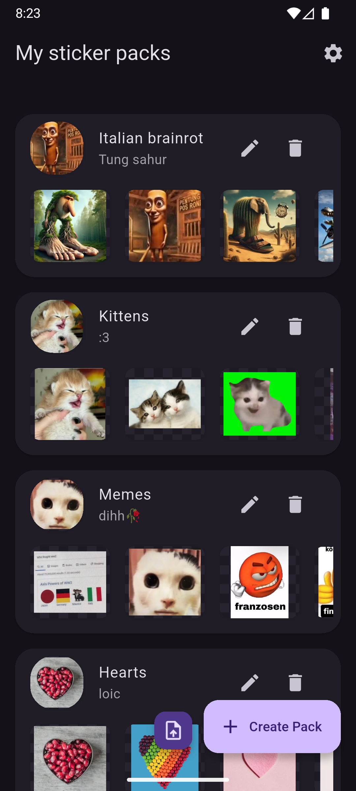
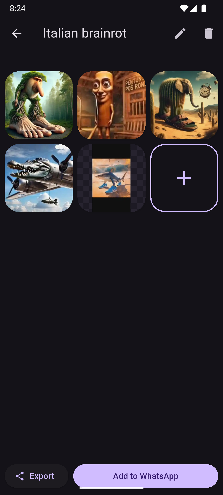
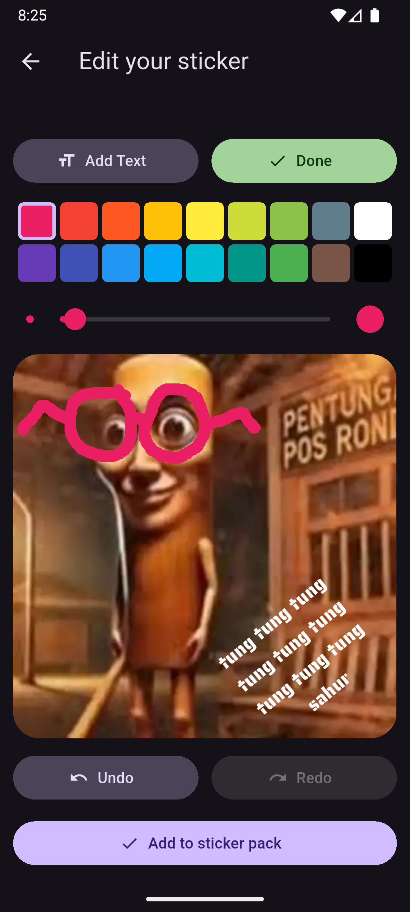

# Stickers

Simple android sticker maker for WhatsApp without ads.

[](https://play.google.com/store/apps/details?id=de.loicezt.stickers)

Or download from the latest [GitHub Release](https://github.com/lolocomotive/stickers/releases)

## Features

- Quick mode: sharing an image to the app automatically adds it to whatsapp
- Editor
    - Crop your sticker to your heart's content
    - Add texts with different sizes, fonts and colors
    - Draw with different colors and brush sizes, with undo/redo support
    - Every element has its own layer unde the hood, so you can draw above and below texts
- Import/Export
    - Export to `.zip` to share or backup your packs
    - Import from various formats (own `.zip` format, `.wastickers`, `.stickify`, shouldn't be too
      hard to add more because most of them are just a ZIP file with pictures and a simple manifest)
- Create, edit and delete multiple packs and their metadata (author, title, tray icon and more)

## Screenshots

| Home                              | Pack view                         | Editor                                |
|-----------------------------------|-----------------------------------|---------------------------------------|
|  |  |  |

## Building

`flutter run` should work just fine, however if you want to build the release version of the app,
you'll need to either:

<details>
<summary>Use your own signing key</summary>

In `android/` create `key.properties` with

```properties
storeFile=path/to/keystore.jks
keyAlias=your key alias
storePassword=your store password
keyPassword=your key password
```

More details: https://docs.flutter.dev/deployment/android#sign-the-app

</details>

or

<details>
<summary>Use the debug signing config</summary>

In `android/app/build.gradle` around line 29

```
buildTypes {
  release {
    signingConfig signingConfigs.release
  }
}
```

replace `signingConfigs.release` with `signingConfigs.debug` and remove

```
def keystoreProperties = new Properties()
def keystorePropertiesFile = rootProject.file("key.properties")
if (keystorePropertiesFile.exists()) {
    keystorePropertiesFile.withReader('UTF-8') { reader ->
        keystoreProperties.load(reader)
    }
}
```

and

```
signingConfigs {
    create("release") {
        keyAlias = keystoreProperties["keyAlias"]
        keyPassword = keystoreProperties["keyPassword"]
        storeFile = new File(keystoreProperties["storeFile"])
        storePassword = keystoreProperties["storePassword"]
    }
}
```

And it *should* work, only use for testing.
</details>

And the you just need to

```
flutter build apk
```

## Contributing

Any contributions (Pull requests, feature requests and bug reports) are very welcome!
Be aware that I set my line width to 120 instead of 80, so be careful before reformatting entire
files. If you're using vscode put the following in `.vscode/settings.json` .

```json
{
  "dart.lineLength": 120,
  "[dart]": {
    "editor.rulers": [
      120
    ]
  }
}
```

Also the code is not very well documented yet so sorry in advance to anyone trying to read it.

## TODO

Some features I plan to work on in the future

- [ ] Animated stickers support (animated packs do work when imported form a file, but you can't add
  any stickers to them)
- [ ] Selecting multiple packs at once in the home screen
- [ ] Add option to add a background to texts
- [ ] Allow rotating while cropping

## iOS Support

I don't own any Apple devices, therefore I can't build for iOS nor test the iOS app. It's a flutter
app so it should more or less work.
If you want to add iOS support, you're welcome! Here's some things to look out for:

- `image_editor` would have to be modified to support WEBP on iOS (I only added support for WEBP on
  Android)
- `whatsapp_stickers_plus` package might not work (it didn't on Android).
- Many widgets would have to be replaced with their `.adaptive` equivalent if you want it to look
  like an iOS app
